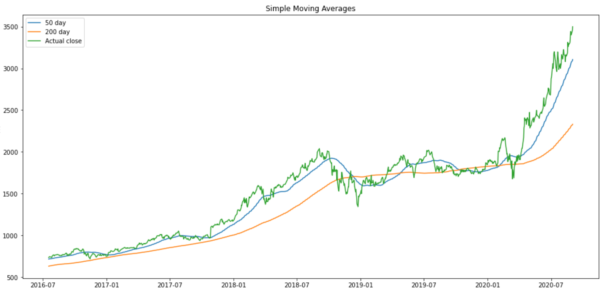
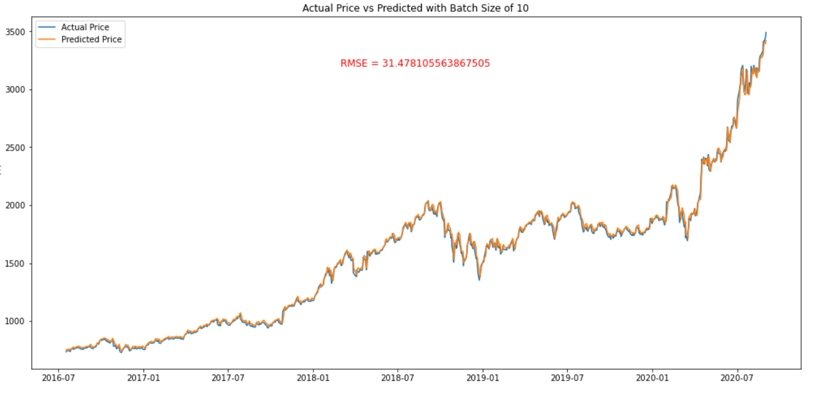

# Stock-Price-Predictions

### Team Members:
- [Rajesh Reddy](https://github.com/rredd002)

  
## Business Situation
A financial services company is seeking to enhance their portfolio management strategies by accurately predicting stock prices. They are looking to develop a robust and reliable stock price prediction model that can provide actionable insights for their investment decisions. The company manages a diverse portfolio of stocks for their clients and aims to maximize returns while minimizing risks.

## Data Overview
We used a dataset for Amazon stock prices which had 20 years of data from 2000-2020. The data was available on AWS and contained 5200 stock price data points.

### Data Limitations
- Data only through 2020
- Only for Amazon stock
- Did not include variables such as market sentiment, economic indicators, or global events

## Feature Engineering 
We created several new columns to assist in our analysis
- Created an average price column which contained the average of the high and low stock price for the day
- Created moving average columns to smooth out the daily fluctuations of the stock prices

## Modeling
- We used RMSE as the metric as this is commonly used in the industry
- The baseline models were created using the 50 day and 200 day moving averages
  
  
- 50 day moving average had RMSE of 135.39 and 200 day moving average had RMSE of 304.88
- We then decided to use LSTM to more accurately predict the day to day shifts in the stock price
- Initial run of the model using hyperparameters of epoch = 1 and batch size = 1 resulted in RMSE of 99.87
- After some experimenting, the final model we usesd was epoch = 15 and batch size = 10

  

## Conclusion
We were able to get an RMSE of 33.55 using 15 epochs and a batch size of 10. If we continue to develop this model and the underlying data we can improve this score further. Based on the prediction plots, we recommend using the LSTM model for shorter term investments and trading as it is more accurate in the day to day fluctuations. For longer term investments, the moving average indicators can be used as these are less computationally expensive. 

## Next Steps 
- Acquire recent data from Amazon.
- Look into how the model applies to other stocks.
- For more volatile stocks, look into echo state network modeling
  
## For More Information
 If you have any questions, please contact our team:

 [Rajesh Reddy](https://github.com/rredd002)

### Repository Structure
├── images

├── gitignore.txt

├── Stock_Price_Prediction_notebook.ipynb

├── README.md 

├── daily_adjusted_AMZN.csv

├── presentation.pdf
